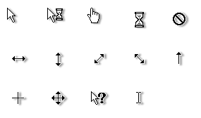

# Classic-Flat-White Shadow

A fork of the excellent cursor theme **[Classic Flat White](https://www.gnome-look.org/p/1102959/)** adding Windows-like shadows.

The shadow parameters may be changed in the `build_all.sh` file (follow [ImageMagick's shadow documentation](https://legacy.imagemagick.org/Usage/blur/#shadow) for reference). The build file requires imagemagick and xcursorgen.
